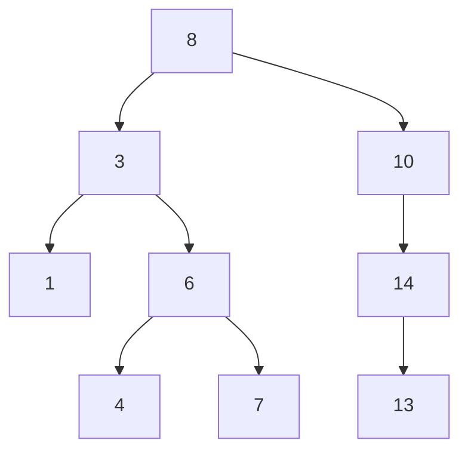

# 🏜️ Binary Search Tree (BST)

A **Binary Search Tree (BST)** is a tree data structure where each node has at most two children. Every node in the left subtree has a value less than the node's value, and every node in the right subtree has a value greater or equal, enabling efficient searching, insertion, and deletion.

---

## 📊 Typical BST Structure

```
         8
       /   \
      3     10
     / \      \
    1   6      14
       / \     /
      4   7   13

```

This layout supports swift operations due to its ordered nature.

---

## 🧹 How BST Operations Work

1. **Insert**:  
   Recursively compare and descend left/right until reaching a `null` position, then insert a new node.
2. **Search/Contains**:  
   Similar to `insert`, but return `true/false` when a matching node is found or a `null` child is reached.
3. **Delete**:

   - **Leaf node**: simply remove it.
   - **Single child**: replace the node with its child.
   - **Two children**: find the in-order predecessor or successor, swap values, and delete that leaf node.

4. **Min/Max**:

   - Minimum = leftmost node.
   - Maximum = rightmost node.

5. **Traversals** (recursive or iterative):

   - **In-order** (sorted output)
   - **Pre-order** (useful for serialization)
   - **Post-order** (useful for cleanup)
   - **Level-order** (breadth-first traversal via a queue)

---

## 🔏 Complexity (assuming ~balanced)

| Operation | Average Time | Worst-case Time |
| --------- | ------------ | --------------- |
| insert    | O(log n)     | O(n)            |
| search    | O(log n)     | O(n)            |
| delete    | O(log n)     | O(n)            |
| in-order  | O(n)         | O(n)            |

---

## 💻 Quick Example

```js
const bst = new BST();
bst.insert(8);
bst
  .insert(3)
  .insert(10)
  .insert(6)
  .insert(14)
  .insert(1)
  .insert(4)
  .insert(7)
  .insert(13);

console.log(bst.contains(6)); // true
console.log(bst.min(), bst.max()); // 1, 14

bst.remove(10); // Node with two children
console.log(bst.inOrder()); // [1,3,4,6,7,8,13,14]
```

---

## 🌳 Tree Structure (Mermaid Diagram)



---

## 🧠 Why Learn BSTs?

- Efficiently **store and query sorted data**
- Fundamental for understanding balanced trees (e.g., AVL, Red‑Black)
- Basis for advanced structures like **interval trees**, **prefix trees**, and **search indexes**
- Frequent BST operations appear in interviews and real-world apps like databases and file systems

---

## 🏋️ Additional Functionalities (Nice-to-have)

- `height()` – test tree depth
- `isBalanced()` – check for AVL-style balance
- `findClosest(value)` – nearest value search
- `lowestCommonAncestor(n1, n2)`
- `rangeSearch(min, max)` – collect values in an interval

---

## 📚 Resources & References

- GeeksforGeeks: BST Overview & Operations
- Mermaid Diagrams in Markdown
- Markdown-Based Tree Diagrams
