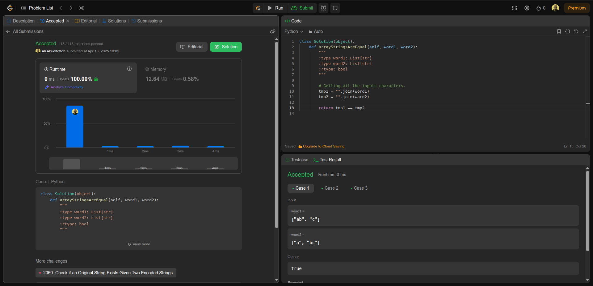

# [1662. Check If Two String Arrays are Equivalent](https://leetcode.com/problems/check-if-two-string-arrays-are-equivalent/)

Given two string arrays `word1` and `word2`, return `true` _if the two arrays **represent** the same string, and_ `false` _otherwise._

A string is **represented** by an array if the array elements concatenated **in order** forms the string.

**Example 1:**

**Input:** word1 = ["ab", "c"], word2 = ["a", "bc"]
**Output:** true
**Explanation:**
word1 represents string "ab" + "c" -> "abc"
word2 represents string "a" + "bc" -> "abc"
The strings are the same, so return true.

**Example 2:**

**Input:** word1 = ["a", "cb"], word2 = ["ab", "c"]
**Output:** false

**Example 3:**

**Input:** word1 = ["abc", "d", "defg"], word2 = ["abcddefg"]
**Output:** true

**Constraints:**

- `1 <= word1.length, word2.length <= 103`
- `1 <= word1[i].length, word2[i].length <= 103`
- `1 <= sum(word1[i].length), sum(word2[i].length) <= 103`
- `word1[i]` and `word2[i]` consist of lowercase letters.

---

