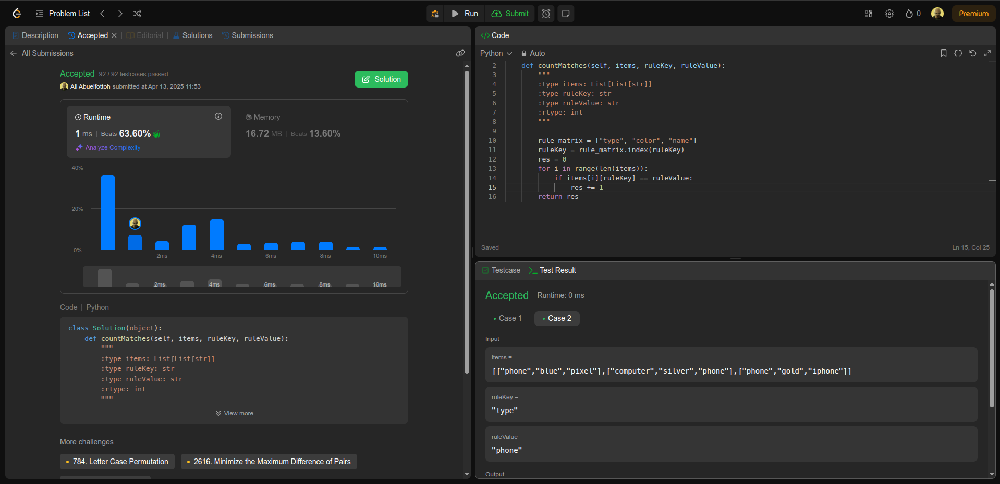

# [1773. Count Items Matching a Rule](https://leetcode.com/problems/count-items-matching-a-rule/)

You are given an array `items`, where each `items[i] = [typei, colori, namei]` describes the type, color, and name of the `ith` item. You are also given a rule represented by two strings, `ruleKey` and `ruleValue`.

The `ith` item is said to match the rule if **one** of the following is true:

- `ruleKey == "type"` and `ruleValue == typei`.
- `ruleKey == "color"` and `ruleValue == colori`.
- `ruleKey == "name"` and `ruleValue == namei`.

Return _the number of items that match the given rule_.

**Example 1:**

**Input:** items = [["phone","blue","pixel"],["computer","silver","lenovo"],["phone","gold","iphone"]], ruleKey = "color", ruleValue = "silver"
**Output:** 1
**Explanation:** There is only one item matching the given rule, which is ["computer","silver","lenovo"].

**Example 2:**

**Input:** items = [["phone","blue","pixel"],["computer","silver","phone"],["phone","gold","iphone"]], ruleKey = "type", ruleValue = "phone"
**Output:** 2
**Explanation:** There are only two items matching the given rule, which are ["phone","blue","pixel"] and ["phone","gold","iphone"]. Note that the item ["computer","silver","phone"] does not match.

**Constraints:**

- `1 <= items.length <= 104`
- `1 <= typei.length, colori.length, namei.length, ruleValue.length <= 10`
- `ruleKey` is equal to either `"type"`, `"color"`, or `"name"`.
- All strings consist only of lowercase letters.

---

