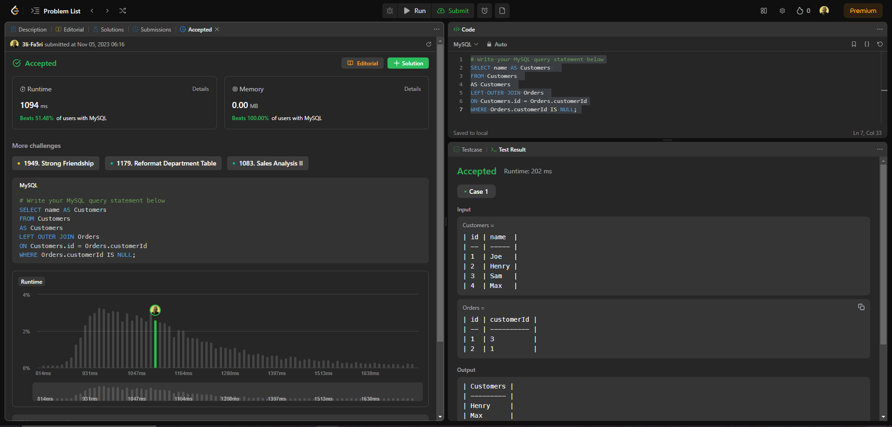

[183. Customers Who Never Order](https://leetcode.com/problems/customers-who-never-order/)

---

Table: `Customers`

```sql
+-------------+---------+
| Column Name | Type    |
+-------------+---------+
| id          | int     |
| name        | varchar |
+-------------+---------+
```

id is the primary key (column with unique values) for this table.
Each row of this table indicates the ID and name of a customer.

Table: `Orders`

```sql
+-------------+------+
| Column Name | Type |
+-------------+------+
| id          | int  |
| customerId  | int  |
+-------------+------+
```

id is the primary key (column with unique values) for this table.
customerId is a foreign key (reference columns) of the ID from the Customers table.
Each row of this table indicates the ID of an order and the ID of the customer who ordered it.

Write a solution to find all customers who never order anything.

Return the result table in **any order**.

The result format is in the following example.

**Example 1:**

**Input:**
Customers table:

```sql
+----+-------+
| id | name  |
+----+-------+
| 1  | Joe   |
| 2  | Henry |
| 3  | Sam   |
| 4  | Max   |
+----+-------+
```

Orders table:

```sql
+----+------------+
| id | customerId |
+----+------------+
| 1  | 3          |
| 2  | 1          |
+----+------------+
```

**Output:**

```sql
+-----------+
| Customers |
+-----------+
| Henry     |
| Max       |
+-----------+
```


