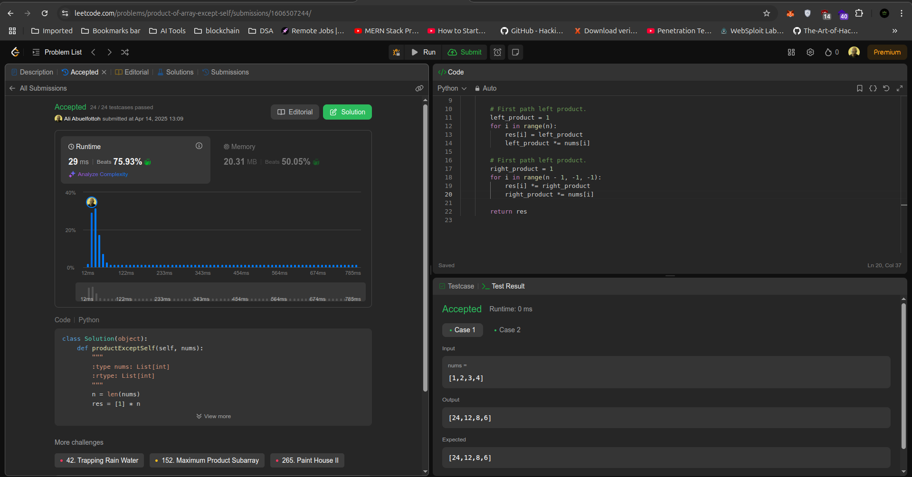

# [238. Product of Array Except Self](https://leetcode.com/problems/product-of-array-except-self/)

---

Hint

Given an integer array `nums`, return _an array_ `answer` _such that_ `answer[i]` _is equal to the product of all the elements of_ `nums` _except_ `nums[i]`.

The product of any prefix or suffix of `nums` is **guaranteed** to fit in a **32-bit** integer.

You must write an algorithm that runs in `O(n)` time and without using the division operation.

**Example 1:**

**Input:** nums = [1,2,3,4]
**Output:** [24,12,8,6]

**Example 2:**

**Input:** nums = [-1,1,0,-3,3]
**Output:** [0,0,9,0,0]

**Constraints:**

- `2 <= nums.length <= 105`
- `-30 <= nums[i] <= 30`
- The input is generated such that `answer[i]` is **guaranteed** to fit in a **32-bit** integer.

**Follow up:** Can you solve the problem in `O(1)` extra space complexity? (The output array **does not** count as extra space for space complexity analysis.)

---

