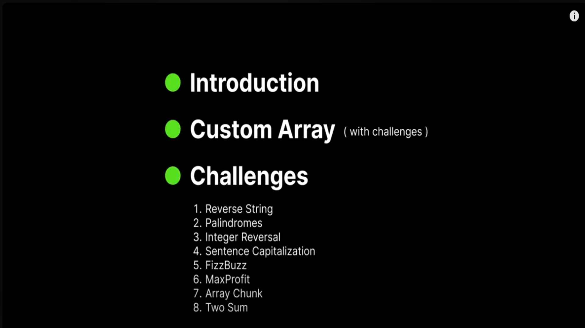

# Array Data Structure

This repository contains implementations and solutions for various array-based problems and algorithms. Below is a list of the included files with their descriptions and, where applicable, links to corresponding LeetCode challenges.

## Table of Contents

- Custom Array
- Reverse String
- Palindromes
- Integer Reversal
- Sentence Capitalization
- FizzBuzz
- MaxProfit
- Array Chunk
- Two Sum

## Custom Array

- **Description**: A custom array data structure implementation with basic operations like push, pop, get, and delete.
- **LeetCode Link**: No direct equivalent on LeetCode.

## Reverse String

- **Description**: A solution to reverse a given string using array manipulation.
- **LeetCode Link**: [Reverse String](https://leetcode.com/problems/reverse-string/)

## Palindromes

- **Description**: Checks if a given string is a palindrome by leveraging array techniques.
- **LeetCode Link**: [Valid Palindrome](https://leetcode.com/problems/valid-palindrome/)

## Integer Reversal

- **Description**: Reverses the digits of a given integer while handling edge cases like overflow.
- **LeetCode Link**: [Reverse Integer](https://leetcode.com/problems/reverse-integer/)

## Sentence Capitalization

- **Description**: Capitalizes the first letter of each word in a sentence using array processing.
- **LeetCode Link**: No direct equivalent on LeetCode.

## FizzBuzz

- **Description**: Prints numbers from 1 to n, replacing multiples of 3 with "Fizz", multiples of 5 with "Buzz", and multiples of both with "FizzBuzz".
- **LeetCode Link**: [Fizz Buzz](https://leetcode.com/problems/fizz-buzz/)

## Max Profit

- **Description**: Finds the maximum profit from buying and selling a stock given an array of prices.
- **LeetCode Link**: [Best Time to Buy and Sell Stock](https://leetcode.com/problems/best-time-to-buy-and-sell-stock/)

## Array Chunk

- **Description**: Splits an array into smaller arrays of a specified size.
- **LeetCode Link**: No direct equivalent on LeetCode.

## Two Sum

- **Description**: Finds two numbers in an array that add up to a target sum and returns their indices.
- **LeetCode Link**: [Two Sum](https://leetcode.com/problems/two-sum/)
