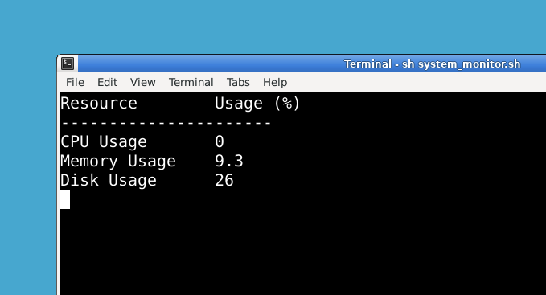

# Introduction

In this project, you will create a Linux system monitor using a shell script. This script will continuously track the CPU, memory, and disk usage of your system, displaying the usage percentages in real time. If the usage of any resource exceeds a preset threshold, an alert will be displayed. By completing this project, you will learn foundational Linux scripting skills while building a practical tool.

## 🎯 Tasks

By completing this project, you will:

- Learn how to create a shell script to monitor system resources.
- Understand how to set and use threshold values for CPU, memory, and disk usage.
- Create a function to send alerts when thresholds are exceeded.

## 🏆 Achievements

After completing this project, you will:

- Be able to create and run a Linux system monitor using a shell script.
- Understand how to work with system resource commands like top, free, and df.
- Be equipped to extend the script by adding new features, such as email notifications.

## **1. Shebang (`#!/bin/bash`)**

This tells the system that the script should be executed using the Bash shell.

---

## **2. Defining Threshold Variables**

bash

CopyEdit

`CPU_THRESHOLD=80
MEMORY_THRESHOLD=80
DISK_THRESHOLD=80`

- These variables define the usage limits (in percentage) for CPU, memory, and disk.
- If usage exceeds these thresholds, an alert will be triggered.

---

## **3. Function to Send an Alert**

bash

CopyEdit

`send_alert() {
  echo "$(tput setaf 1)ALERT: $1 usage exceeded threshold! Current value: $2%$(tput sgr0)"
}`

- This function takes two arguments:
  - `$1` → Resource name (e.g., "CPU", "Memory", "Disk").
  - `$2` → Current usage percentage.
- It uses `tput setaf 1` to color the alert message **red** (for better visibility).
- `tput sgr0` resets the color back to normal.

---

### **Testing the Alert Function**

bash

CopyEdit

`send_alert "CPU" 85`

- This line calls the function manually to test it.
- It should print:  
  **ALERT: CPU usage exceeded threshold! Current value: 85%**

---

## **4. Monitoring CPU Usage**

bash

CopyEdit

`cpu_usage=$(top -bn1 | grep "Cpu(s)" | awk '{print $2 + $4}')
cpu_usage=${cpu_usage%.*} # Convert to integer
echo "Current CPU usage: $cpu_usage%"`

### **Breaking it Down**

1.  **`top -bn1`**
    - `b` → Runs `top` in batch mode (suitable for scripts).
    - `n1` → Runs only **one** iteration.
2.  **`grep "Cpu(s)"`**
    - Extracts the line containing CPU usage stats.
3.  **`awk '{print $2 + $4}'`**
    - `$2` → User CPU usage.
    - `$4` → System CPU usage.
    - Adds both values together.
4.  **`cpu_usage=${cpu_usage%.*}`**
    - Removes decimal places to get an **integer**.
5.  **Checking Threshold**

bash

CopyEdit

`if ((cpu_usage >= CPU_THRESHOLD)); then
  send_alert "CPU" "$cpu_usage"
fi`

- If CPU usage exceeds the threshold (80%), an alert is triggered.

---

## **5. Monitoring Memory Usage**

bash

CopyEdit

`memory_usage=$(free | awk '/Mem/ {printf("%3.1f", ($3/$2) * 100)}')
echo "Current memory usage: $memory_usage%"
memory_usage=${memory_usage%.*}`

### **Breaking it Down**

1.  **`free`** → Shows memory usage.
2.  **`awk '/Mem/ {printf("%3.1f", ($3/$2) * 100)}'`**
    - Searches for the line containing "Mem".
    - `$3` → Used memory.
    - `$2` → Total memory.
    - Calculates percentage: `(used / total) * 100`.
    - `%3.1f` → Formats output to 1 decimal place.
3.  **`memory_usage=${memory_usage%.*}`**
    - Removes decimal to make it an **integer**.
4.  **Checking Threshold**

bash

CopyEdit

`if ((memory_usage >= MEMORY_THRESHOLD)); then
  send_alert "Memory" "$memory_usage"
fi`

- If memory usage is **80% or more**, an alert is sent.

---

## **6. Monitoring Disk Usage**

bash

CopyEdit

`disk_usage=$(df -h / | awk '/\// {print $(NF-1)}')
disk_usage=${disk_usage%?} # Remove the % sign
echo "Current disk usage: $disk_usage%"`

### **Breaking it Down**

1.  **`df -h /`** → Shows disk usage in human-readable format (`-h`).
2.  **`awk '/\// {print $(NF-1)}'`**
    - Finds the disk usage percentage (`/` root partition).
    - `$(NF-1)` extracts the **second last column**, which is **usage%**.
3.  **`disk_usage=${disk_usage%?}`**
    - Removes the **`%`** sign to make it a pure number.
4.  **Checking Threshold**

bash

CopyEdit

`if ((disk_usage >= DISK_THRESHOLD)); then
  send_alert "Disk" "$disk_usage"
fi`

- If disk usage reaches **80% or more**, an alert is sent.

---

## **7. Continuous Monitoring with `while true`**

bash

CopyEdit

`while true; do`

- Runs the monitoring **indefinitely**.

### **Inside the Loop**

The same CPU, memory, and disk usage calculations are repeated **continuously**.

- If thresholds are exceeded, alerts are triggered.

bash

CopyEdit

`clear
echo "Resource Usage:"
echo "CPU: $cpu_usage%"
echo "Memory: $memory_usage%"
echo "Disk: $disk_usage%"
sleep 2`

- `clear` → Clears the screen for a **live updating** effect.
- Displays CPU, memory, and disk usage.
- `sleep 2` → Waits **2 seconds** before running the loop again.

---

## **Summary**

This script: ✅ Monitors **CPU, memory, and disk usage**.  
✅ Alerts the user when usage exceeds **80%**.  
✅ Runs **continuously** in a loop, refreshing every **2 seconds**.  
✅ Uses **color formatting** to highlight alerts.
